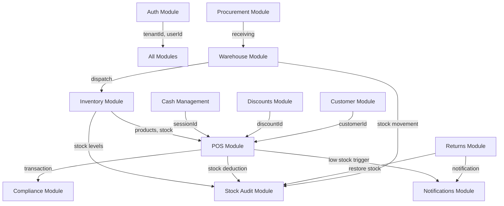

# JSSI POS — Backend Wiring Guide for Frontend Developers

> Base URL: `http://localhost:3000` (dev) | `https://hellopos-<revision>.run.app` (prod)
> Swagger UI: `{BASE_URL}/api/docs`

---

## Table of Contents

1. [Architecture Overview](#architecture-overview)
2. [Authentication & Authorization](#authentication--authorization)
3. [Operator Session (Cashier PIN)](#operator-session-cashier-pin)
4. [Module Map & Endpoints](#module-map--endpoints)
5. [Complete Flows](#complete-flows)
6. [WebSocket (Real-time Notifications)](#websocket-real-time-notifications)
7. [Key Conventions](#key-conventions)
8. [Enums Reference](#enums-reference)

---

## Architecture Overview

```
┌───────────────────────────────────────────────────────────────────────┐
│                         FRONTEND APPS                                  │
│    Mobile (Expo/RN)            Dashboard (Next.js)                     │
└───────────────────────┬───────────────────────────┬───────────────────┘
                        │ HTTP + WebSocket           │
                        ▼                            ▼
┌───────────────────────────────────────────────────────────────────────┐
│                    NestJS Backend (Port 3000)                          │
│                                                                       │
│  ┌─── Guards (pipeline) ────────────────────────────────────────┐    │
│  │  1. FirebaseAuthGuard → verifies JWT, enriches request.user   │    │
│  │  2. OperatorContextInterceptor → attaches request.operator    │    │
│  │  3. RolesGuard → checks role vs @Roles() decorator           │    │
│  │  4. PermissionsGuard → checks fine-grained @Permissions()     │    │
│  └───────────────────────────────────────────────────────────────┘    │
│                                                                       │
│  ┌── Modules ──────────────────────────────────────────────────┐     │
│  │ Auth │ Inventory │ POS │ Cash │ Discounts │ Returns │ ...   │     │
│  └─────────────────────────────────────────────────────────────┘     │
│                         │                                             │
│                         ▼                                             │
│               PostgreSQL (TypeORM)                                     │
└───────────────────────────────────────────────────────────────────────┘
```

### Multi-Tenancy

Every entity belongs to a `tenantId`. The backend reads `tenantId` from the Firebase JWT custom claims and scopes all queries to that tenant. **Frontends never pass tenantId** — it's extracted server-side.

---

## Authentication & Authorization

### Firebase JWT Flow

```
┌─────────┐         ┌──────────────┐         ┌──────────────┐
│ Frontend │──1──▶   │   Firebase   │         │   Backend    │
│          │◀──2──   │   Auth       │         │              │
│          │──3──────────────────────────────▶│              │
│          │◀──4──────────────────────────────│              │
└─────────┘         └──────────────┘         └──────────────┘

1. Frontend calls Firebase signInWithEmailAndPassword()
2. Firebase returns ID token (JWT)
3. Frontend sends request with Authorization: Bearer <token>
4. Backend verifies token, enriches user context, processes request
```

### Required Headers

| Header | Purpose | Required |
|--------|---------|----------|
| `Authorization` | `Bearer <firebase-id-token>` | Always (except `@Public()` routes) |
| `X-Device-UUID` | Device identifier for operator session resolution | For POS operations |

### Token Custom Claims (set after registration)

```json
{
  "uid": "firebase-uid-string",
  "email": "user@example.com",
  "role": "TENANT_ADMIN",
  "tenantId": 1
}
```

> **Important**: After registration, user must sign out and sign back in to refresh token with new claims.

### User Roles

| Role | Access Level |
|------|-------------|
| `TENANT_ADMIN` | Full access to everything. Bypasses permission checks. |
| `STORE_MANAGER` | Store-level management, reports, approvals |
| `CASHIER` | POS transactions, customer lookup, basic inventory read |
| `WAREHOUSE_STAFF` | Procurement, dispatch, receiving, stock management |
| `DRIVER` | Dispatch delivery operations |

### Fine-Grained Permissions

Beyond roles, individual users can be granted/revoked permissions:

| Permission | Description |
|-----------|-------------|
| `MANAGE_DISCOUNTS` | Create/edit/delete discounts |
| `VOID_TRANSACTIONS` | Void completed transactions |
| `VIEW_REPORTS` | Access Z-readings and reports |
| `MANAGE_STOCK` | Stock adjustments |
| `PROCESS_RETURNS` | Handle return requests |
| `MANAGE_CUSTOMERS` | Customer CRUD |
| `MANAGE_SUPPLIERS` | Supplier CRUD |
| `MANAGE_USERS` | User management |
| `MANAGE_STORES` | Store configuration |
| `ACCESS_ADMIN_PANEL` | Dashboard access |

---

## Operator Session (Cashier PIN)

The operator session system allows multiple cashiers to share a single device login. The device authenticates once with Firebase (via the admin's account), then individual cashiers switch in/out using PIN codes.

### Flow

```
┌─────────────┐                    ┌──────────────┐
│   Mobile    │                    │   Backend    │
│   (POS)     │                    │              │
└──────┬──────┘                    └──────┬───────┘
       │                                   │
       │  1. Device logs in (Firebase)     │
       │──────────────────────────────────▶│
       │                                   │
       │  2. Register device               │
       │  POST /devices                    │
       │──────────────────────────────────▶│
       │         { deviceUuid }            │
       │◀──────────────────────────────────│
       │                                   │
       │  3. Cashier enters PIN            │
       │  POST /operator-sessions/switch   │
       │  Body: { deviceUuid, pin }        │
       │──────────────────────────────────▶│
       │  ← { operatorId, role, name }     │
       │◀──────────────────────────────────│
       │                                   │
       │  4. All subsequent requests       │
       │  include X-Device-UUID header     │
       │──────────────────────────────────▶│
       │  (backend resolves operator from  │
       │   active session on that device)  │
       │                                   │
       │  5. End shift                     │
       │  DELETE /operator-sessions/:uuid  │
       │──────────────────────────────────▶│
```

### How Operator Context Works

When `X-Device-UUID` header is present:
1. `OperatorContextInterceptor` looks up the active session for that device
2. Resolves the operator's `User` record  
3. Sets `request.operator` with full user info (role, name, storeId)
4. Overrides `request.user.role` and `request.user.operatorId`
5. `RolesGuard` and `PermissionsGuard` use the **operator's** role/permissions

**Result**: A single Firebase login can serve multiple cashiers via PIN switching.

---

## Module Map & Endpoints

For the complete source-verified endpoint tables (all methods, paths, roles, and permissions), use:

- `docs/api-documentation.md`
- `docs/mobile-web-backend-integration-blueprint.md` (implementation-level mobile/web wiring plan)
- `docs/mobile-web-integration-implementation-backlog.md` (sprint-ready execution checklist)

This section keeps a quick integration map for frontend wiring.

| Module | Main Prefixes | Notes |
|--------|---------------|-------|
| System | `/`, `/health` | Public health and root routes |
| Auth & Identity | `/auth`, `/tenants`, `/users`, `/devices`, `/operator-sessions` | Includes operator PIN/session workflows |
| Inventory | `/categories`, `/products`, `/stock-levels`, `/modifiers`, `/inventory/events` | Includes modifier groups/options/product mappings and SSE stream |
| POS | `/transactions` | Transaction create/list/detail/void and line-items/payments |
| Cash Management | `/cash-register-sessions`, `/cash-drawer-events` | Shift open/close plus drawer event log |
| Discounts | `/discounts` | `MANAGE_DISCOUNTS` permission enforced on create/update |
| Customer | `/customers` | Customer CRUD used by checkout/returns |
| Compliance | `/receipts`, `/z-readings`, `/tax-configs` | Receipt and BIR-adjacent reporting config |
| Returns | `/returns` | Approve/reject/complete return lifecycle |
| Procurement | `/suppliers`, `/purchase-orders`, `/purchase-order-items` | PO + supplier management |
| Warehouse & Stores | `/stores`, `/warehouses`, `/batches`, `/dispatches`, `/dispatch-items`, `/receiving-records` | Inbound/outbound stock logistics |
| Physical Inventory | `/stock-counts` | Count, item update, complete/approve/cancel |
| Stock Audit | `/stock-movements` | Append-only movement ledger |
| Notifications | `/notifications` + WebSocket namespace | In-app alert CRUD and realtime channel |
| Operation Logs | `/operation-logs` | Entity-level activity tracking |

### Important Access Notes

- Public endpoints: `GET /`, `GET /health`, `GET /auth/health`
- `POST /auth/register` is authenticated (valid Firebase token) even without explicit role decorator
- Some endpoints intentionally allow any authenticated role (for example several `/devices` and `/operator-sessions` routes)
- Current controller role decorators use `WAREHOUSE_STAFF`, while shared enums still include `WAREHOUSE_MANAGER`

---

## Complete Flows

### Flow 1: First-Time Setup (Registration → Store Creation)

```
Frontend                                           Backend
   │                                                  │
   │  1. Firebase signInWithEmailAndPassword()        │
   │  ─────────────────────────────────────────────▶  │
   │  ← Firebase ID token                            │
   │                                                  │
   │  2. POST /auth/register                          │
   │  Body: { businessName, tin, address,             │
   │          firstName, lastName, contactPhone }     │
   │  ─────────────────────────────────────────────▶  │
   │  ← { tenant: {uuid, name},                      │
   │       user: {uuid, email, role},                 │
   │       message: "Sign out and sign back in..." }  │
   │                                                  │
   │  3. Firebase signOut() → signIn() again          │
   │  (refreshes token with role+tenantId claims)     │
   │  ─────────────────────────────────────────────▶  │
   │                                                  │
   │  4. POST /stores                                 │
   │  Body: { name, address, phone }                  │
   │  ─────────────────────────────────────────────▶  │
   │  ← Store entity with id, uuid                   │
   │                                                  │
   │  5. POST /categories (create product categories) │
   │  6. POST /products (add products)                │
   │  7. POST /warehouses (optional)                  │
```

---

### Flow 2: POS Sale Transaction (Complete Checkout)

```
Frontend (Mobile POS)                              Backend
   │                                                  │
   │  ── SHIFT START ──                               │
   │                                                  │
   │  1. POST /operator-sessions/switch               │
   │  Body: { deviceUuid, pin: "1234" }              │
   │  Headers: Authorization: Bearer <token>          │
   │  ─────────────────────────────────────────────▶  │
   │  ← { operatorId, role, firstName, lastName }     │
   │                                                  │
   │  2. POST /cash-register-sessions                 │
   │  Body: { storeId, deviceId, openingBalance: "500.00" }│
   │  Headers: + X-Device-UUID: <device-uuid>         │
   │  ─────────────────────────────────────────────▶  │
   │  ← { id, uuid, status: "OPEN" }                 │
   │                                                  │
   │  ── DURING SHIFT (repeat per customer) ──        │
   │                                                  │
   │  3. GET /products?page=1&limit=50                │
   │  ─────────────────────────────────────────────▶  │
   │  ← { data: [...products], total, page }          │
   │                                                  │
   │  4. GET /discounts/active                        │
   │  ─────────────────────────────────────────────▶  │
   │  ← [...active discounts]                        │
   │                                                  │
   │  5. (Optional) GET /customers?search=Juan        │
   │  ─────────────────────────────────────────────▶  │
   │  ← { data: [...matches] }                       │
   │                                                  │
   │  6. POST /transactions                           │
   │  Body: {                                         │
   │    storeId: 1,                                   │
   │    sessionId: 5,          ← cash register ID     │
   │    customerId: 12,        ← optional             │
   │    discountId: 3,         ← optional (txn-level) │
   │    lineItems: [                                  │
   │      { productId: 7, quantity: 2,                │
   │        modifiers: [{ modifierOptionId: 4 }] },   │
   │      { productId: 12, quantity: 1,               │
   │        discountId: 5 }    ← item-level discount  │
   │    ],                                            │
   │    payments: [                                   │
   │      { method: "CASH", amount: "500.00",         │
   │        amountTendered: "1000.00" },              │
   │      { method: "GCASH", amount: "200.00",        │
   │        referenceNumber: "GC-12345" }             │
   │    ]                                             │
   │  }                                               │
   │  ─────────────────────────────────────────────▶  │
   │                                                  │
   │  Backend atomically:                             │
   │    • Validates products exist in tenant          │
   │    • Calculates VAT per line item                │
   │    • Applies SC/PWD or regular discount          │
   │    • Validates payment ≥ total                   │
   │    • Deducts stock levels                        │
   │    • Records stock movements (SALE)              │
   │    • Triggers LOW_STOCK notification if needed   │
   │                                                  │
   │  ← { id, uuid, transactionNumber,               │
   │       subtotal, vatAmount, discountAmount,       │
   │       totalAmount, status: "COMPLETED",          │
   │       lineItems: [...], payments: [...] }        │
   │                                                  │
   │  7. POST /receipts                               │
   │  Body: { transactionId, type: "OFFICIAL_RECEIPT" }│
   │  ─────────────────────────────────────────────▶  │
   │  ← { receiptNumber, content, ... }              │
   │                                                  │
   │  ── SHIFT END ──                                 │
   │                                                  │
   │  8. POST /cash-register-sessions/:uuid/close     │
   │  Body: { closingBalance: "12500.00",             │
   │          notes: "All good" }                     │
   │  ─────────────────────────────────────────────▶  │
   │  ← { status: "CLOSED", ... }                    │
   │                                                  │
   │  9. DELETE /operator-sessions/:deviceUuid        │
   │  ─────────────────────────────────────────────▶  │
```

---

### Flow 3: Return/Refund

```
Frontend                                           Backend
   │                                                  │
   │  1. POST /returns                                │
   │  Body: {                                         │
   │    transactionId: 42,                            │
   │    storeId: 1,                                   │
   │    reason: "Defective item",                     │
   │    lineItems: [                                  │
   │      { lineItemId: 101, quantity: 1 }            │
   │    ]                                             │
   │  }                                               │
   │  ─────────────────────────────────────────────▶  │
   │  ← { uuid, status: "PENDING" }                  │
   │                                                  │
   │  2. PATCH /returns/:uuid/approve                 │
   │  (Manager action)                                │
   │  ─────────────────────────────────────────────▶  │
   │                                                  │
   │  Backend atomically:                             │
   │    • Updates return status → APPROVED            │
   │    • Restores stock levels                       │
   │    • Records stock movement (RETURN)             │
   │    • Fires RETURN_APPROVED notification          │
   │                                                  │
   │  ← { status: "APPROVED", refundAmount }          │
```

---

### Flow 4: Procurement → Stock Receiving

```
Frontend (Dashboard)                               Backend
   │                                                  │
   │  1. POST /suppliers                              │
   │  Body: { name, contactPerson, phone, email }     │
   │  ─────────────────────────────────────────────▶  │
   │  ← { id, uuid, name }                           │
   │                                                  │
   │  2. POST /purchase-orders                        │
   │  Body: { supplierId, warehouseId, notes,         │
   │          expectedDeliveryDate }                   │
   │  ─────────────────────────────────────────────▶  │
   │  ← { id, uuid, status: "DRAFT" }                │
   │                                                  │
   │  3. POST /purchase-order-items                   │
   │  Body: { purchaseOrderId, productId,             │
   │          quantity, unitCost: "150.00" }           │
   │  ─────────────────────────────────────────────▶  │
   │                                                  │
   │  4. PATCH /purchase-orders/:uuid                 │
   │  Body: { status: "SUBMITTED" }                   │
   │  ─────────────────────────────────────────────▶  │
   │                                                  │
   │  ─── (goods arrive) ───                          │
   │                                                  │
   │  5. POST /receiving-records                      │
   │  Body: { purchaseOrderId, warehouseId,           │
   │          items: [{productId, quantityReceived}] } │
   │  ─────────────────────────────────────────────▶  │
   │                                                  │
   │  Backend:                                        │
   │    • Creates receiving record                    │
   │    • Updates stock levels in warehouse           │
   │    • Records stock movement (RECEIVE)            │
   │    • Updates PO status → RECEIVED or PARTIALLY   │
```

---

### Flow 5: Warehouse → Store Dispatch

```
Frontend (Dashboard)                               Backend
   │                                                  │
   │  1. POST /dispatches                             │
   │  Body: { warehouseId, storeId, notes }           │
   │  ─────────────────────────────────────────────▶  │
   │  ← { id, uuid, status: "PENDING" }              │
   │                                                  │
   │  2. POST /dispatch-items                         │
   │  Body: { dispatchId, productId, quantity,        │
   │          batchId (optional) }                    │
   │  ─────────────────────────────────────────────▶  │
   │                                                  │
   │  3. PATCH /dispatches/:uuid                      │
   │  Body: { status: "DISPATCHED" }                  │
   │  ─────────────────────────────────────────────▶  │
   │                                                  │
   │  Backend:                                        │
   │    • Deducts warehouse stock                     │
   │    • Records stock movement (DISPATCH)           │
   │    • Fires DISPATCH_UPDATE notification          │
   │                                                  │
   │  ─── (store receives goods) ───                  │
   │                                                  │
   │  4. PATCH /dispatches/:uuid                      │
   │  Body: { status: "RECEIVED" }                    │
   │  ─────────────────────────────────────────────▶  │
   │                                                  │
   │  Backend:                                        │
   │    • Adds stock to store                         │
   │    • Records stock movement (RECEIVE)            │
```

---

### Flow 6: End-of-Day Compliance

```
Frontend (Dashboard)                               Backend
   │                                                  │
   │  1. POST /z-readings                             │
   │  Body: { storeId, date: "2025-05-26",            │
   │          type: "Z_READING" }                     │
   │  ─────────────────────────────────────────────▶  │
   │                                                  │
   │  Backend:                                        │
   │    • Aggregates all transactions for the date    │
   │    • Sums: grossSales, netSales, vatAmount,      │
   │      discounts, returns, voidedAmount            │
   │    • Generates sequential Z-counter              │
   │                                                  │
   │  ← { uuid, zCounter, grossSales, netSales,      │
   │       vatAmount, discountTotal, returnTotal,     │
   │       voidTotal, transactionCount }              │
```

---

### Flow 7: Discount Application (Philippine SC/PWD)

```
Frontend                                           Backend
   │                                                  │
   │  SC/PWD Discount Flow:                           │
   │                                                  │
   │  1. Customer presents SC/PWD ID                  │
   │  2. Cashier attaches customer to transaction     │
   │     (customer.discountType = "SC" or "PWD")      │
   │                                                  │
   │  3. POST /transactions                           │
   │  Body: { ..., discountId: <sc-discount-id>,      │
   │          customerId: <sc-customer-id> }          │
   │  ─────────────────────────────────────────────▶  │
   │                                                  │
   │  Backend SC/PWD logic:                           │
   │    • Identifies VATABLE items                    │
   │    • Removes VAT from eligible items             │
   │    • Applies % discount on VAT-exclusive price   │
   │    • SC/PWD = 20% off + VAT exempt (standard)    │
   │                                                  │
   │  Example: Item ₱112 (₱100 + ₱12 VAT)            │
   │    → SC discount: ₱100 × 20% = ₱20 off          │
   │    → VAT removed: ₱12                            │
   │    → Customer pays: ₱80 (not ₱112)              │
```

---

## WebSocket (Real-time Notifications)

### Connection

```typescript
import { io } from 'socket.io-client';

const socket = io(`${BASE_URL}/notifications`, {
  auth: { token: firebaseIdToken },
});

socket.on('connect', () => {
  console.log('Connected to notifications');
});

socket.on('notification', (data) => {
  // { id, type, title, message, metadata }
  console.log('New notification:', data);
});

socket.on('connect_error', (err) => {
  console.error('WS auth failed:', err.message);
});
```

### Room Routing

The backend automatically subscribes clients to rooms based on their token claims:

| Room | Who Receives | Use Case |
|------|-------------|----------|
| `tenant:{tenantId}` | All users in tenant | Tenant-wide alerts |
| `user:{userId}` | Specific user | Personal notifications |
| `store:{storeId}` | All staff at a store | Store-level alerts (low stock) |

### Auto-Triggered Notifications

| Trigger | Type | Channel | Recipient |
|---------|------|---------|-----------|
| Sale reduces stock below `reorderPoint` | `LOW_STOCK` | IN_APP + WS | Store room |
| Return approved | `RETURN_APPROVED` | IN_APP + WS | Requesting user |
| Dispatch status change | `DISPATCH_UPDATE` | IN_APP + WS | Store room |

---

## Key Conventions

### 1. ID Strategy

Every entity has:
- `id` (integer, auto-increment) — used internally, in foreign keys, and in DTOs
- `uuid` (UUID v4) — used in URL paths for public-facing APIs

**Frontend should**: Use UUIDs in URLs, but reference IDs in request bodies (e.g., `productId: 7`).

### 2. Decimal Values

All monetary and percentage values are **strings** in JSON:
```json
{
  "unitPrice": "150.0000",
  "vatRate": "12.00",
  "totalAmount": "1680.0000"
}
```

**Frontend should**: Parse with `parseFloat()` for display, send as string in request bodies.

### 3. Date-Only Fields

Date fields without time (e.g., `validFrom`, `expectedDeliveryDate`) are stored as `YYYY-MM-DD` strings:
```json
{ "validFrom": "2025-01-01", "validTo": "2025-12-31" }
```

### 4. Pagination

Paginated endpoints return:
```json
{
  "data": [...],
  "total": 150,
  "page": 1,
  "limit": 50
}
```

Query params: `?page=1&limit=50`

### 5. Error Format

```json
{
  "statusCode": 400,
  "message": "Validation error message",
  "error": "Bad Request"
}

// or for validation errors:
{
  "statusCode": 400,
  "message": ["field must be a string", "field2 is required"],
  "error": "Bad Request"
}
```

### 6. Payment Methods

```typescript
type PaymentMethod = 'CASH' | 'CREDIT_CARD' | 'DEBIT_CARD' | 'GCASH' | 'MAYA' | 'QRPH' | 'BANK_TRANSFER' | 'OTHER';
```

---

## Enums Reference

### UserRole
`TENANT_ADMIN` | `STORE_MANAGER` | `CASHIER` | `WAREHOUSE_MANAGER` | `DRIVER`

Route decorators in current controllers also use `WAREHOUSE_STAFF` for warehouse-scoped endpoints.

### TransactionStatus
`PENDING` | `COMPLETED` | `VOIDED` | `REFUNDED`

### PaymentMethod
`CASH` | `CREDIT_CARD` | `DEBIT_CARD` | `GCASH` | `MAYA` | `QRPH` | `BANK_TRANSFER` | `OTHER`

### PaymentStatus
`PENDING` | `COMPLETED` | `FAILED` | `REFUNDED`

### CashRegisterSessionStatus
`OPEN` | `CLOSED` | `SUSPENDED`

### CashDrawerEventType
`CASH_IN` | `CASH_OUT`

### DiscountType
`SC` | `PWD` | `PERCENTAGE` | `FIXED_AMOUNT` | `VOUCHER`

### VatType
`VATABLE` | `VAT_EXEMPT` | `ZERO_RATED`

### PurchaseOrderStatus
`DRAFT` | `SUBMITTED` | `APPROVED` | `PARTIALLY_RECEIVED` | `RECEIVED` | `CANCELLED`

### DispatchStatus
`PENDING` | `DISPATCHED` | `RECEIVED` | `CANCELLED`

### ReturnStatus
`PENDING` | `APPROVED` | `REJECTED` | `COMPLETED`

### StockMovementType
`SALE` | `RETURN` | `RECEIVE` | `DISPATCH` | `ADJUSTMENT` | `TRANSFER` | `VOID`

### NotificationType
`LOW_STOCK` | `CRITICAL_STOCK` | `EXPIRY_WARNING` | `DISPATCH_UPDATE` | `RETURN_APPROVED` | `SYSTEM`

### Permission
`MANAGE_DISCOUNTS` | `VOID_TRANSACTIONS` | `VIEW_REPORTS` | `MANAGE_STOCK` | `PROCESS_RETURNS` | `MANAGE_CUSTOMERS` | `MANAGE_SUPPLIERS` | `MANAGE_USERS` | `MANAGE_STORES` | `ACCESS_ADMIN_PANEL`

---

## Module Dependency Graph



---

## Quick Start Checklist (Frontend Developer)

1. **Set up Firebase Auth** — Get `signInWithEmailAndPassword` working
2. **Register** — `POST /auth/register` with business info
3. **Sign out / Sign in** — Refresh token to get claims
4. **Create a Store** — `POST /stores`
5. **Add Categories** — `POST /categories`
6. **Add Products** — `POST /products` (requires valid `categoryId`)
7. **Open Cash Register** — `POST /cash-register-sessions`
8. **Make a Sale** — `POST /transactions`
9. **Generate Receipt** — `POST /receipts`
10. **Close Shift** — `POST /cash-register-sessions/:uuid/close`
